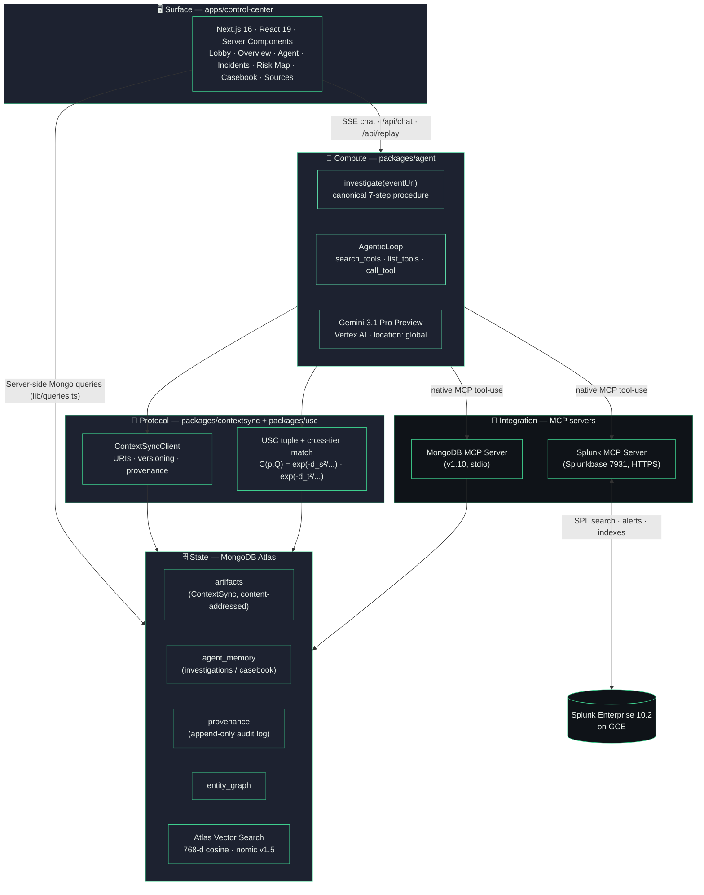
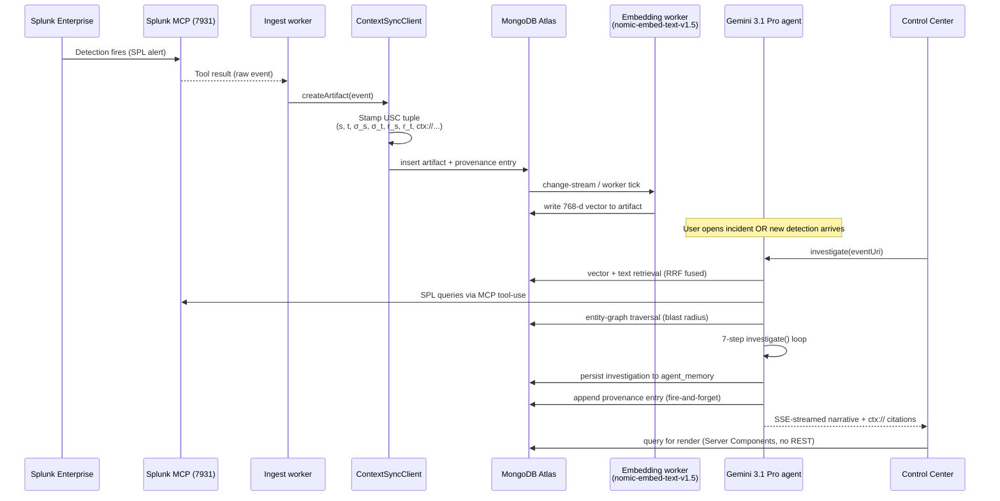
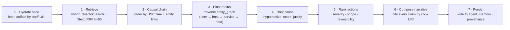

# Meridian — Architecture Diagram

> Context-aware incident intelligence on the MetisOS protocol stack.
> **State and compute, decoupled.**

---

## High-level tiers



---

## End-to-end flow — detection → narrative



---

## The seven-step `investigate()` procedure



---

## ASCII fallback (renders anywhere)

```
┌──────────────────────────────────────────────────────────────────────┐
│  Surface       apps/control-center  (Next.js 16, React 19, Server   │
│                                       Components, MCP-free)         │
│                                            ↑                         │
│  Compute       packages/agent          investigate()  +              │
│                                        AgenticLoop (meta-tools)      │
│                  ┌─────────────────────┼─────────────────────┐       │
│                  │   GeminiClient      │   MCP clients       │       │
│                  │   (Vertex / API key)│   (mongo, splunk)   │       │
│                  └─────────────────────┴─────────────────────┘       │
│                                            ↕                         │
│  Persistence   MongoDB Atlas   artifacts · agent_memory · provenance │
│                                · entity_graph · actors               │
│                                Vector indexes (768d cosine)          │
│                                            ↕                         │
│  Protocol      packages/contextsync    ContextSyncClient             │
│                packages/usc            USC tuple + cross-tier match  │
│                                            ↕                         │
│  Integration   Splunk MCP (Splunkbase 7931, Splunk Enterprise 10.2)  │
│                MongoDB MCP (mongodb-mcp-server v1.10, stdio)         │
└──────────────────────────────────────────────────────────────────────┘
```

---

## Why this shape

- **Surface, compute, state, protocol, integration** are five distinct tiers. Each can evolve without the others. Swap Splunk for Sentinel? Only the integration tier changes. Swap Gemini 3 for the next model? Only the compute tier changes. The contract between tiers is the **ContextSync URI**.

- **Citations aren't free-text strings — they're `ctx://` URIs**. Every claim in the surface dereferences back to a content-addressed artifact in state. This is what makes "every claim is cited" *enforceable*.

- **USC** (Universal Spatiotemporal Coordinates) stamps every artifact with a seven-field tuple `(s, t, σ_s, σ_t, r_s, r_t, frame)`. Cross-tier matching becomes a closed-form Gaussian product, not a heuristic — and Meridian computes it live from stored fields, never synthesizes it.

- **MCP everywhere.** Splunk over Streamable HTTP. MongoDB as a stdio subprocess. Gemini 3 uses native MCP tool-use via `@google/genai`, so the model can reason about its tool surface using meta-tools (`search_tools`, `list_tools`, `call_tool`).
